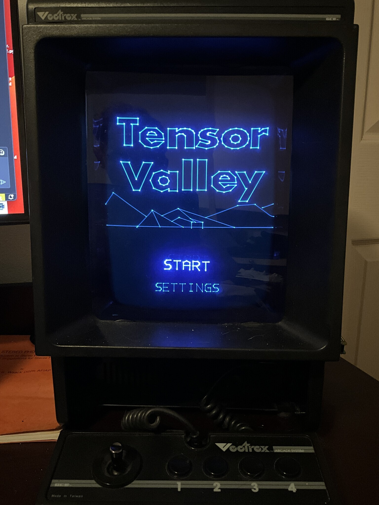

# Tensor Valley (PiTrex)

Tensor Valley is a Vectrex game build for PiTrex.

## Downloads

- Pi Zero 1 build: `piZero1/tensor-ZERO1.img`
- Pi Zero 2 build: `piZero2/tensor-ZERO2.img`

Current public build: **v1.27**

## Install

1. ***RENAME the tensor-ZEROX.img to test.img OR rebel.img (BACK UP rebel.img before writing over it)***
2. Copy the correct .img to your SD card:
   - `piZero1/test.img` for Pi Zero 1
   - `piZero2/test.img` for Pi Zero 2
3. Boot PiTrex.
4. Launch from Pitrex menu, Pitrex Computer icon, move right to test or rebel (for testing the Tensor Valley game).

## Notes

- This repo currently contains **binary releases only**.
- Source code is not published here yet.

## Credits

- Game: Brandon Yates
- Platform: BareMetal PiTrex / Vectrex
